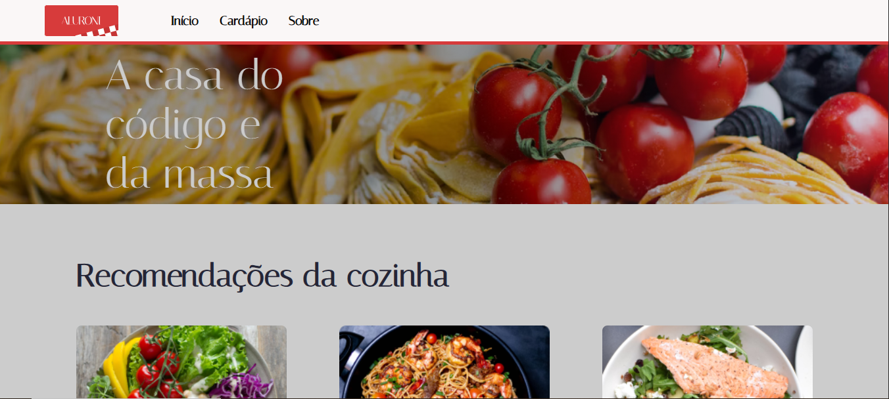

# Aluroni Casa de Massas

Projeto desenvolvido durante a formação de React Router Dom da Alura.

## 🔨 Funcionalidades do projeto

Página de um restaurante fictício com seletor de pratos, navegação, dentre outras funcionalidades.

## ✔️ Técnicas e tecnologias utilizadas

  
  
  
  

## 📁 Acesso ao projeto

- ### [Deploy do Aluroni](https://aluroni-phi-three.vercel.app/)

- ### [GitHub do Aluroni](https://github.com/Misael1981/aluroni)

<h2> 📞 Contato</h2>

 
  
  
   
  

